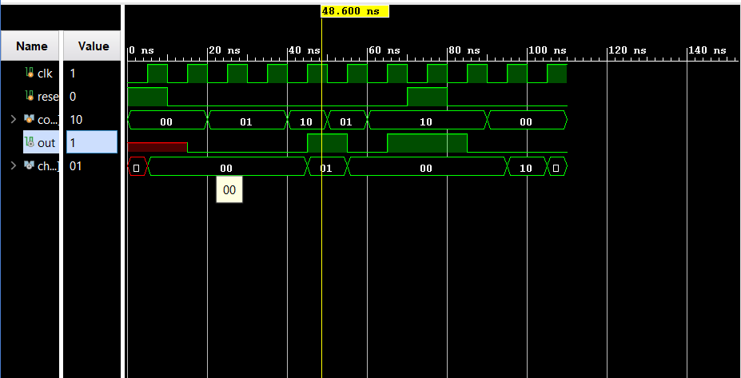

# Vending Machine FSM (Finite State Machine)

A Verilog implementation of a vending machine controller using a finite state machine approach. This module handles coin insertion, product dispensing, and change calculation.

## Overview

This vending machine accepts $5 and $10 coins and dispenses a product worth $15. The machine calculates and returns appropriate change when necessary.

## Module Interface

### Inputs
- `clk` - Clock signal for synchronous operation
- `reset` - Active high reset signal
- `coin[1:0]` - 2-bit coin input encoding:
  - `00`: No coin ($0)
  - `01`: $5 coin
  - `10`: $10 coin
  - `11`: Invalid (treated as $10)

### Outputs
- `out` - Product dispensing signal (1 = dispense product)
- `change[1:0]` - Change amount in $5 units:
  - `00`: No change
  - `01`: $5 change
  - `10`: $10 change

## State Machine Design

The vending machine operates using a 3-state finite state machine:

### States
- **S0 (2'b00)**: Initial state - No money inserted
- **S1 (2'b01)**: $5 inserted - Need $10 more
- **S2 (2'b10)**: $10 inserted - Need $5 more

### State Transitions

| Current State | Coin Input | Next State | Output | Change |
|---------------|------------|------------|--------|---------|
| S0 | $0 | S0 | No product | $0 |
| S0 | $5 | S1 | No product | $0 |
| S0 | $10 | S2 | No product | $0 |
| S1 | $0 | S0 | No product | $5 |
| S1 | $5 | S2 | No product | $0 |
| S1 | $10 | S0 | **Product** | $0 |
| S2 | $0 | S0 | No product | $10 |
| S2 | $5 | S0 | **Product** | $0 |
| S2 | $10 | S0 | **Product** | $5 |

## Features

- **Synchronous Design**: All state transitions occur on positive clock edges
- **Reset Functionality**: Active high reset returns machine to initial state
- **Change Calculation**: Automatic change dispensing when overpayment occurs
- **Money Return**: Pressing no coin ($0) returns inserted money as change

## Simulation Results



The simulation waveform shows:
- Clock signal running at regular intervals
- Reset signal controlling machine initialization
- Coin input sequence testing different scenarios
- Output signal indicating product dispensing
- Change output showing calculated change amounts

### Test Scenarios Visible in Waveform:
1. **Reset Operation**: Machine returns to initial state
2. **$5 Coin Insert**: Transitions from S0 to S1
3. **$10 Coin Insert**: Transitions and product dispensing
4. **Change Calculation**: Proper change output for overpayment scenarios

## Design Considerations

1. **Product Price**: Fixed at $15
2. **Coin Denominations**: Only $5 and $10 coins accepted
3. **Change Limitation**: Change given in $5 increments only
4. **State Encoding**: Uses 2-bit binary encoding for 3 states
5. **Combinational Logic**: Next state and output logic implemented in single always block

## File Structure

```
vending_machine/
├── vending_machine.v          # Main Verilog module
├── vending_machine_tb.v       # Testbench file
├── simulation_waveform.png    # Simulation results
└── README.md                  # This documentation
```

## Testing

The module has been tested with various input combinations to verify:
- Correct state transitions
- Proper product dispensing logic
- Accurate change calculations
- Reset functionality
- Edge cases and corner scenarios

## Technical Specifications

- **Technology**: Verilog HDL
- **Synthesis**: Synthesizable design
- **Timing**: Synchronous design with single clock domain
- **Reset**: Synchronous reset with asynchronous initialization
- **State Machine Type**: Moore machine (outputs depend on current state)

## Future Enhancements

Potential improvements could include:
- Support for additional coin denominations
- Multiple product selection
- Coin inventory tracking
- Display interface for user feedback
- Error handling for insufficient change scenarios

Thank You 
